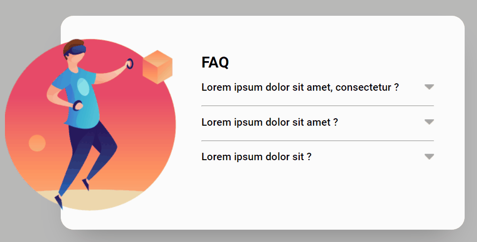

# Accordion
Accordion is a hidden description of a topic, or question, very common in website FAQs. Every time that an item is selected, the content is displayed and the arrow change the color. The unselected items must hide the content and set gray color for the arrow.

## Desktop Overview 🖳

## Link
- [Accordion - GitHub Pages](https://Antonio-Savio.github.io/accordion/)

## Languages used 👨‍💻
- HTML
- CSS
- JavaScript

## What I learned
- Handling class lists in JS can be tough for beginners and it wasn't different for me. Knowing where to place the class, when to add and remove was tricky.
- How to manage a loop in HTMLCollection, instead of NodeList.
- Refactor the code passing 'this' as attribute.
